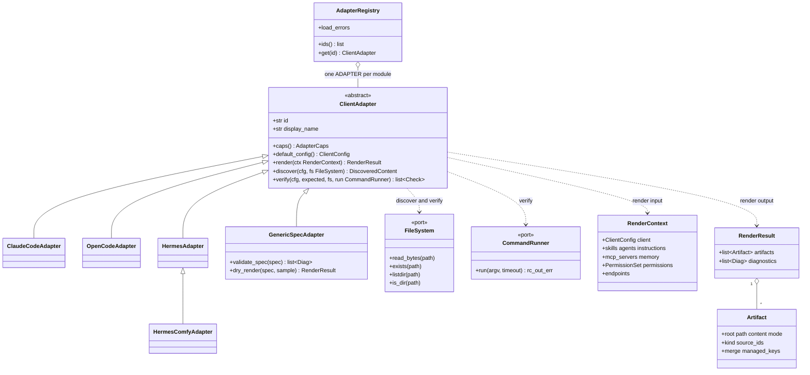

# Client adapter classes

Mermaid. Names are from `backend/src/agent_hub/adapters/`; a variant module is a tiny
subclass exposing its own id.

Rules that hold for every adapter: `render` is pure; artifacts use relative safe paths under a named root; output is
deterministic; an agent with no tools is an error; unsupported or lossy mappings are diagnostics (`error` when the client
is `strict`); `verify` must not report `ok` from a copy alone.
