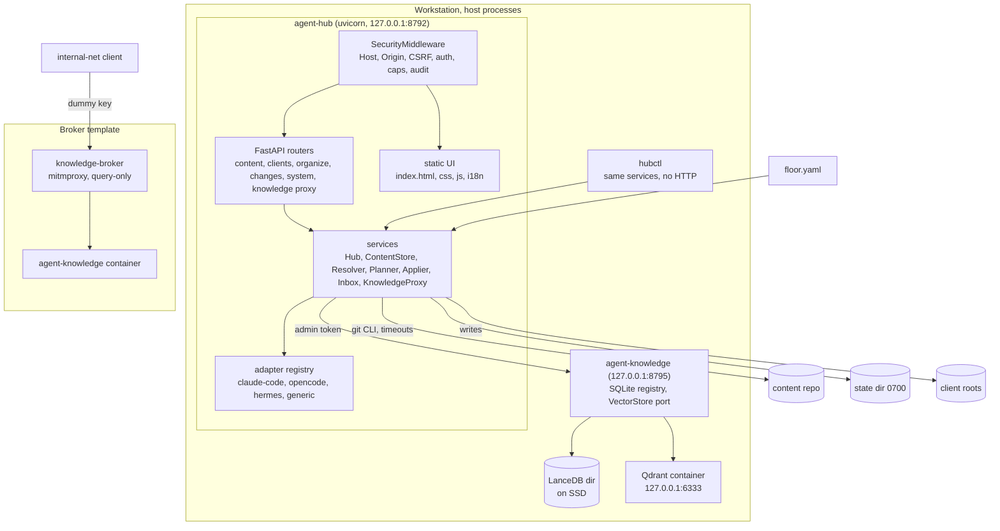

# Containers and processes

Mermaid. There are no Docker containers in the hub itself: it and the knowledge service are
host processes. The containers shown belong to the opt-in broker template.

```mermaid
flowchart TB
  subgraph host["Workstation, host processes"]
    subgraph hubp["agent-hub (uvicorn, 127.0.0.1:8792)"]
      mw["SecurityMiddleware<br/>Host, Origin, CSRF, auth, caps, audit"]
      api["FastAPI routers<br/>content, clients, organize, changes, system, knowledge proxy"]
      svc["services<br/>Hub, ContentStore, Resolver, Planner, Applier, Inbox, KnowledgeProxy"]
      reg["adapter registry<br/>claude-code, opencode, hermes, generic"]
      ui["static UI<br/>index.html, css, js, i18n"]
      mw --> api --> svc --> reg
      mw --> ui
    end
    cli["hubctl<br/>same services, no HTTP"]
    cli --> svc
    kp["agent-knowledge (127.0.0.1:8795)<br/>SQLite registry, VectorStore port"]
    lance[("LanceDB dir<br/>on SSD")]
    qd["Qdrant container<br/>127.0.0.1:6333"]
    kp --> lance
    kp --> qd
  end
  svc -->|"git CLI, timeouts"| repo[("content repo")]
  svc --> st[("state dir 0700")]
  svc -->|"writes"| roots[("client roots")]
  svc -->|"admin token"| kp
  pol["floor.yaml"] --> svc

  subgraph tmpl["Broker template"]
    br["knowledge-broker<br/>mitmproxy, query-only"]
    kc["agent-knowledge container"]
    br --> kc
  end
  cl["internal-net client"] -->|"dummy key"| br
```
