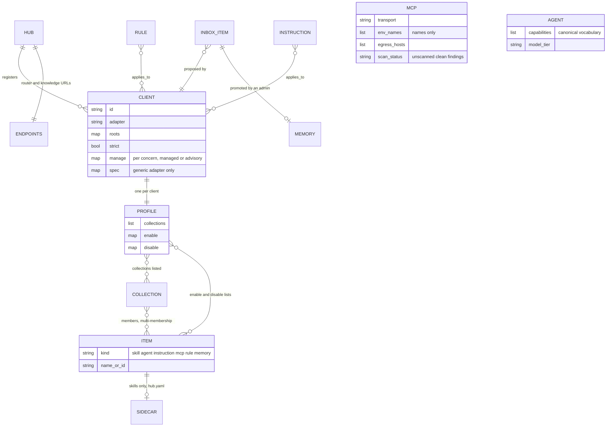

# Content model

Mermaid. Layout from `ARCHITECTURE.md` section 3.
Names and ids match `^[a-z0-9][a-z0-9._-]{0,63}$`.

Files: `hub.yaml`, `endpoints.yaml`, `instructions/<id>.md`, `skills/<name>/SKILL.md` (+ `hub.yaml` sidecar),
`agents/<name>.md`, `mcp/<name>.yaml`, `rules/<id>.yaml`, `memory/<id>.md`, `inbox/<client>/<id>.md` (never compiled),
`collections/<id>.yaml`, `clients/<id>.yaml`, `profiles/<client>.yaml`. Effective set per client =
union(collection members, `enable`) minus `disable`, then the policy floor, then `adapter.render`.
