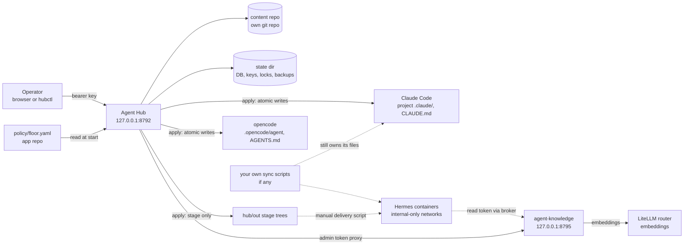

# System context

Mermaid.

```mermaid
flowchart LR
  op["Operator<br/>browser or hubctl"]
  hub["Agent Hub<br/>127.0.0.1:8792"]
  content[("content repo<br/>own git repo")]
  state[("state dir<br/>DB, keys, locks, backups")]
  floor["policy/floor.yaml<br/>app repo"]
  kn["agent-knowledge<br/>127.0.0.1:8795"]
  cl["Claude Code<br/>project .claude/, CLAUDE.md"]
  oc["opencode<br/>.opencode/agent, AGENTS.md"]
  stage["hub/out stage trees"]
  hermes["Hermes containers<br/>internal-only networks"]
  sync["your own sync scripts<br/>if any"]
  router["LiteLLM router<br/>embeddings"]

  op -->|"bearer key"| hub
  hub --> content
  hub --> state
  floor -->|"read at start"| hub
  hub -->|"apply: atomic writes"| cl
  hub -->|"apply: atomic writes"| oc
  hub -->|"apply: stage only"| stage
  stage -.->|"manual delivery script"| hermes
  sync -.->|"still owns its files"| cl
  sync -.-> hermes
  hub -->|"admin token proxy"| kn
  kn -->|"embeddings"| router
  hermes -.->|"read token via broker"| kn
```

Solid arrows are code paths; dashed arrows are manual steps or other processes. The hub never calls your sync scripts,
an engine manager or the router.
