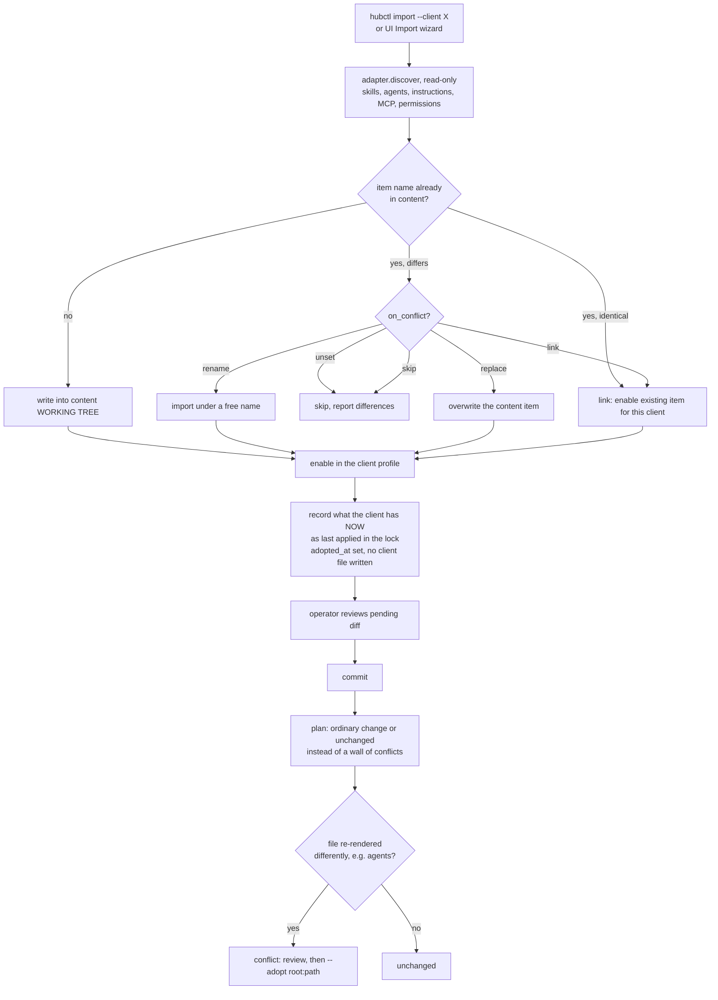

# Import and adopt

Mermaid.

Notes: `adopt_live` only locks files that exist, are managed, are parseable and are adoptable; anything else stays
un-locked and shows as a conflict in the first plan. A client with a lock but `applied_at` 0 has never had a real apply.
