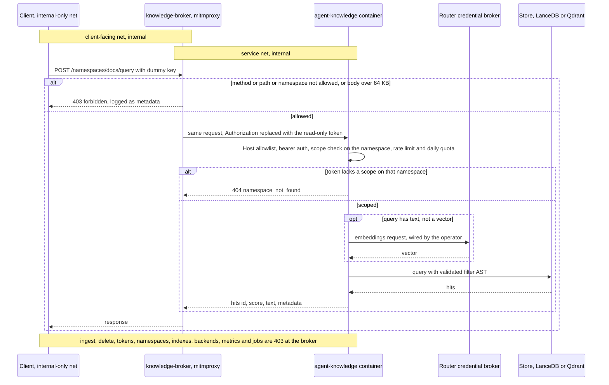

# Knowledge-plane access from an internal-net client

Mermaid. This path uses the broker and container templates in `deploy/knowledge/`, which are templates to adapt.

```mermaid
sequenceDiagram
  participant C as Client, internal-only net
  participant B as knowledge-broker, mitmproxy
  participant K as agent-knowledge container
  participant R as Router credential broker
  participant S as Store, LanceDB or Qdrant

  Note over C,B: client-facing net, internal
  Note over B,K: service net, internal
  C->>B: POST /namespaces/docs/query with dummy key
  alt method or path or namespace not allowed, or body over 64 KB
    B-->>C: 403 forbidden, logged as metadata
  else allowed
    B->>K: same request, Authorization replaced with the read-only token
    K->>K: Host allowlist, bearer auth, scope check on the namespace, rate limit and daily quota
    alt token lacks a scope on that namespace
      K-->>B: 404 namespace_not_found
    else scoped
      opt query has text, not a vector
        K->>R: embeddings request, wired by the operator
        R-->>K: vector
      end
      K->>S: query with validated filter AST
      S-->>K: hits
      K-->>B: hits id, score, text, metadata
    end
    B-->>C: response
  end
  Note over C,K: ingest, delete, tokens, namespaces, indexes, backends, metrics and jobs are 403 at the broker
```
