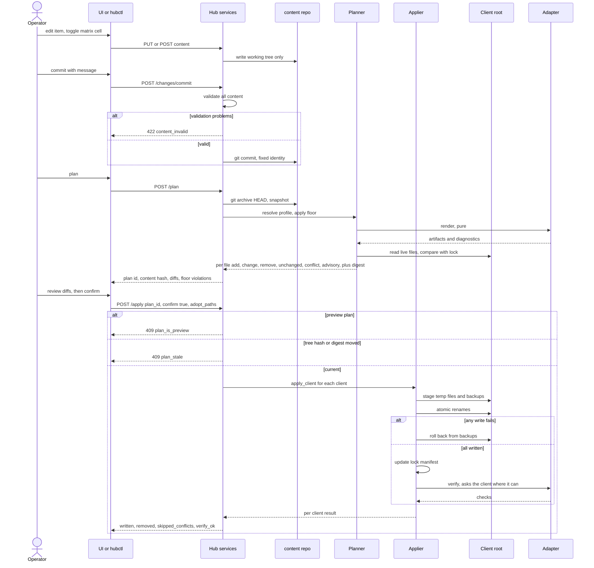

# Edit, commit, plan, apply

Mermaid.

```mermaid
sequenceDiagram
  actor Op as Operator
  participant UI as UI or hubctl
  participant Hub as Hub services
  participant Git as content repo
  participant Pl as Planner
  participant Ap as Applier
  participant FS as Client root
  participant Ad as Adapter

  Op->>UI: edit item, toggle matrix cell
  UI->>Hub: PUT or POST content
  Hub->>Git: write working tree only
  Op->>UI: commit with message
  UI->>Hub: POST /changes/commit
  Hub->>Hub: validate all content
  alt validation problems
    Hub-->>UI: 422 content_invalid
  else valid
    Hub->>Git: git commit, fixed identity
  end
  Op->>UI: plan
  UI->>Hub: POST /plan
  Hub->>Git: git archive HEAD, snapshot
  Hub->>Pl: resolve profile, apply floor
  Pl->>Ad: render, pure
  Ad-->>Pl: artifacts and diagnostics
  Pl->>FS: read live files, compare with lock
  Pl-->>Hub: per file add, change, remove, unchanged, conflict, advisory, plus digest
  Hub-->>UI: plan id, content hash, diffs, floor violations
  Op->>UI: review diffs, then confirm
  UI->>Hub: POST /apply plan_id, confirm true, adopt_paths
  alt preview plan
    Hub-->>UI: 409 plan_is_preview
  else tree hash or digest moved
    Hub-->>UI: 409 plan_stale
  else current
    Hub->>Ap: apply_client for each client
    Ap->>FS: stage temp files and backups
    Ap->>FS: atomic renames
    alt any write fails
      Ap->>FS: roll back from backups
    else all written
      Ap->>Ap: update lock manifest
      Ap->>Ad: verify, asks the client where it can
      Ad-->>Ap: checks
    end
    Ap-->>Hub: per client result
    Hub-->>UI: written, removed, skipped_conflicts, verify_ok
  end
```
